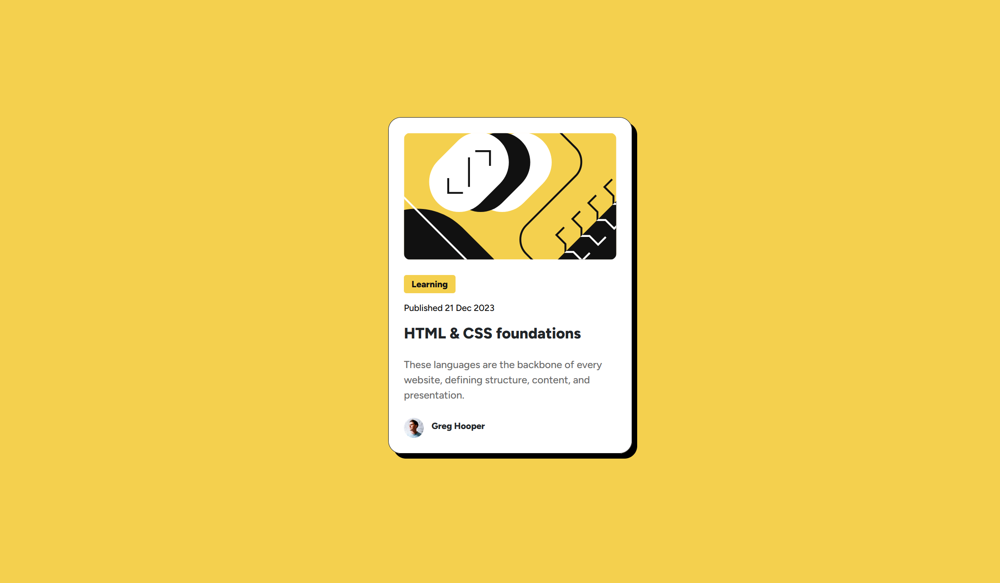

# Frontend Mentor - Blog preview card solution

This is a solution to the [Blog preview card challenge on Frontend Mentor](https://www.frontendmentor.io/challenges/blog-preview-card-ckPaj01IcS). Frontend Mentor challenges help you improve your coding skills by building realistic projects. 

## Table of contents

- [Overview](#overview)
  - [The challenge](#the-challenge)
  - [Screenshot](#screenshot)
  - [Links](#links)
- [My process](#my-process)
  - [Built with](#built-with)
  - [What I learned](#what-i-learned)
  - [Continued development](#continued-development)
  - [Useful resources](#useful-resources)
- [Author](#author)

**Note: Delete this note and update the table of contents based on what sections you keep.**

## Overview

### The challenge

Users should be able to:

- See hover and focus states for all interactive elements on the page

### Screenshot



### Links

- Live Site URL: [https://dudamania.github.io/fem-blog-preview-card/](https://dudamania.github.io/fem-blog-preview-card/)

## My process

### Built with

- CSS custom properties
- Flexbox
- Mobile-first workflow
- [Bootstrap](https://getbootstrap.com/) - Bootstrap for great built in css and mobile-first development
- [Sass](https://sass-lang.com) - Sass for better css management

### What I learned

In this project I made use of flexbox as a better solution to earlier to center a div vertically and horizontally.
```css
.container {
  display: flex;
  flex-direction: row;
  justify-content: center;
  align-items: center;
  height: 100%;
}
```

I also pursued using css variables for colors as to make changing in the future easier.
```css
:root {
    --yellow: #F4D04E;
    --gray950: #111111;
    --gray500: #6B6B6B;
    --white: #FFFFFF;
    --black: #000000;
}
```

### Continued development

I'll definitely focus on using more variables and learning better ways of doing font presets for future projects.

### Useful resources

- [W3 Schools](https://www.w3schools.com) - This website helped as a tool to lookup different attributes for css and html.
- [Sass Lang](https://sass-lang.com) - I used this website to explore how to use css & scss variables to great extent.

## Author

- Website - [Dudley Seddon](https://dudleyseddon.com)
- Frontend Mentor - [@dudamania](https://www.frontendmentor.io/profile/dudamania)
- Twitter - [@dudleyseddon](https://www.twitter.com/dudleyseddon)
